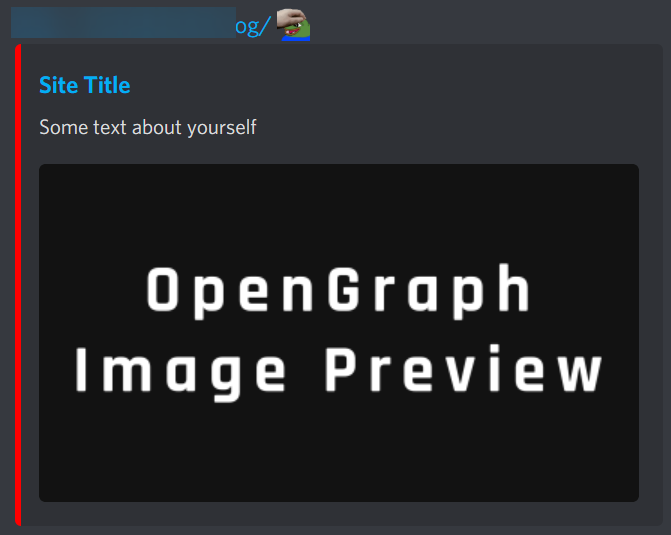

# SUDO's Editable Landing page
# How to install?
Simply clone the repository into your favorite webserver
making sure that all files are kept together in the document root.

# How to edit?
All the elements on the page are generated via the `editme.json` file.

All you need to do is edit the fields in the `editme.json` file and the information on the site will dynamically be updated and built.
## Please Note !
I recommended that you change the OpenGraph meta manually in `index.html`, otherwise you will have the default OpenGraph as seen in the image below
>

# Examples
>
>
